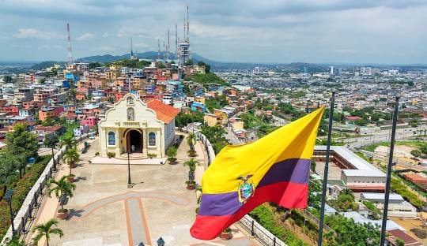

# PRACTICA 08-08-2024  
Esta es un ensayo que estoy realizando para practicar mi capacidad de manejar el *Visual Studio Code*

## Te presento la base de datos del proyecto
- [**Ciudades**](ciudades.csv)  

### Ahora te de presento el codigo 
- [**Codigo**](codigo)
 
### En este te presento parte de la descripcion de Ecuador

*Ecuador es un país sudamericano ubicado en la región noroccidental del continente, con una rica diversidad geográfica que incluye la Amazonía, la región andina, la costa del Pacífico y las islas Galápagos. Su capital, Quito, es conocida por su bien preservado centro histórico colonial, declarado Patrimonio de la Humanidad por la UNESCO. Ecuador es una nación multicultural, hogar de diversas etnias indígenas, mestizas y afrodescendientes. Su economía se basa en la exportación de petróleo, productos agrícolas como banano y flores, y el ecoturismo, especialmente en las Galápagos. Además, el país tiene una gran biodiversidad, siendo uno de los 17 países megadiversos del mundo.*

*Autora de la codificación*: Odalis Narcisa Clemente Pincay  
*Fecha de la realización del proyecto*:  08 de agosto del 2024

